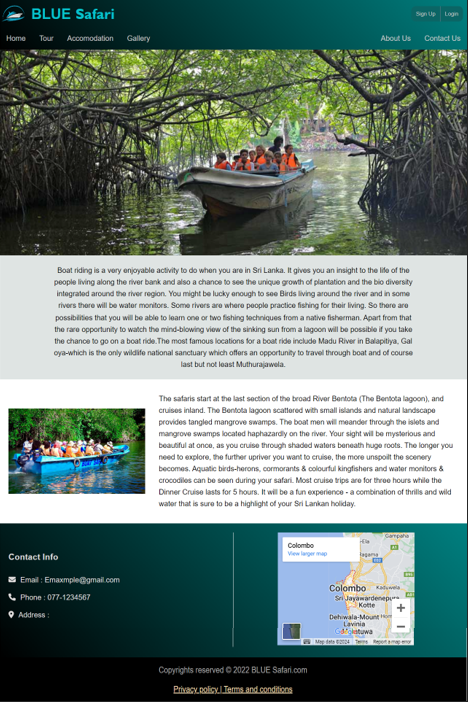
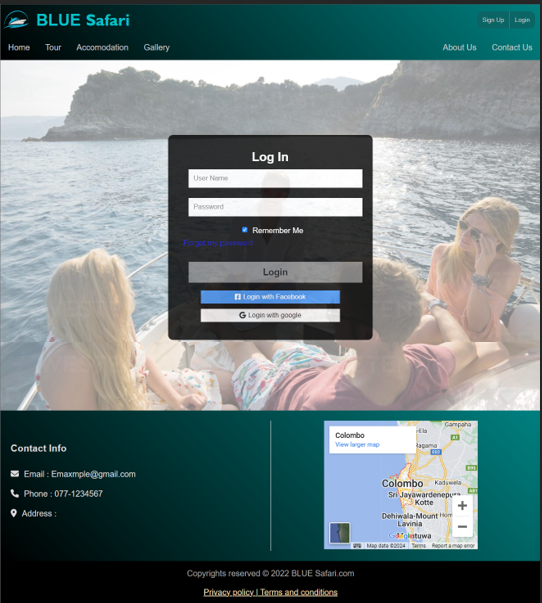

# Boat Safari Management System

This system is designed to streamline the management processes involved in organizing and operating boat safaris using HTML, CSS, JavaScript, and PHP. Whether you're managing a wildlife sanctuary, a tourist destination, or a recreational facility, this system aims to provide an efficient solution for handling reservations, scheduling, resource allocation, and customer management.

### Key Features:

- Reservation Management: Easily manage reservations for boat safaris, including booking, modification, and cancellation functionalities.

- Scheduling: Efficiently create and manage safari schedules, taking into account factors such as boat availability, staff allocation, and customer preferences.

- Customer Management: Maintain detailed records of customers, including contact information, booking history, preferences, and special requirements.

- Payment Processing: Facilitate secure online payments for safari bookings, with support for multiple payment methods and integration with popular payment gateways.

    
    

    
    

    

  

